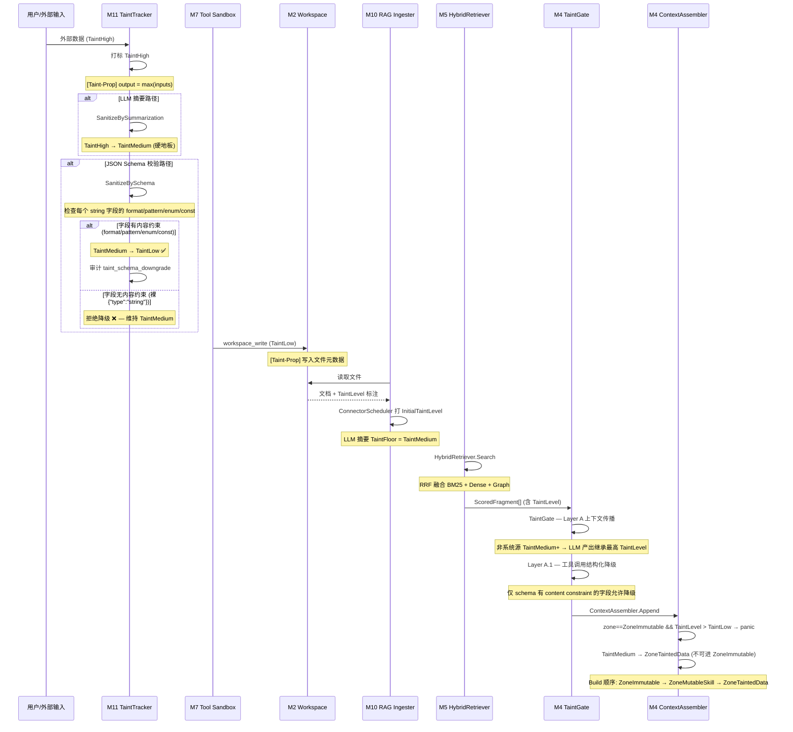
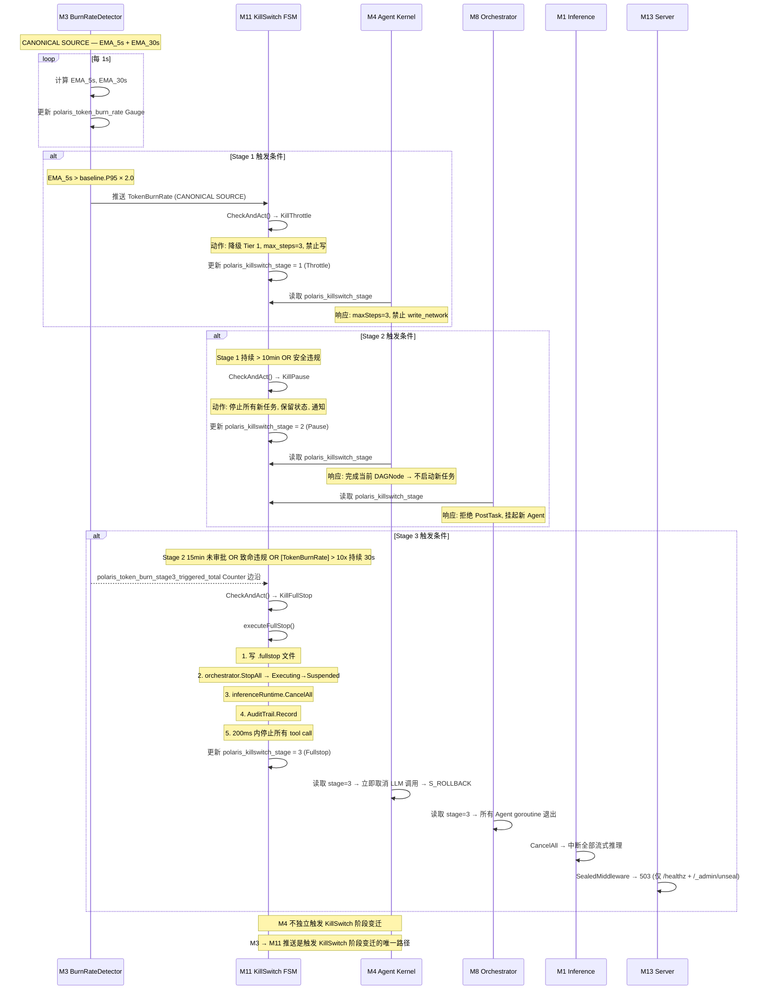
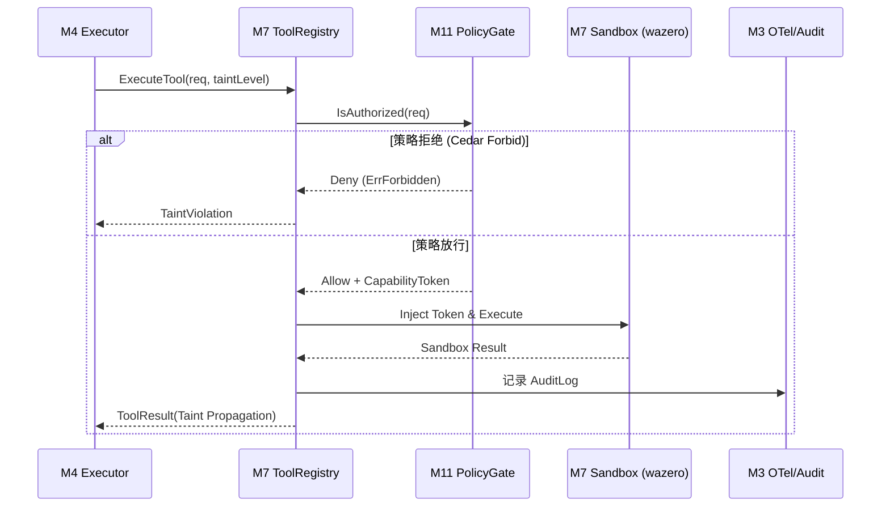
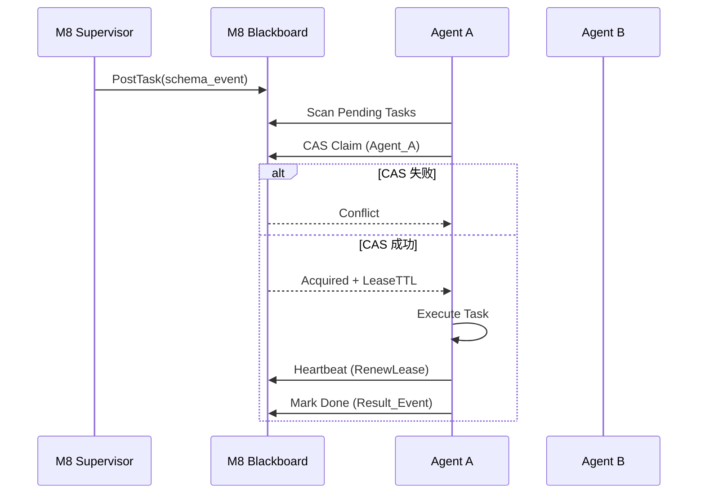
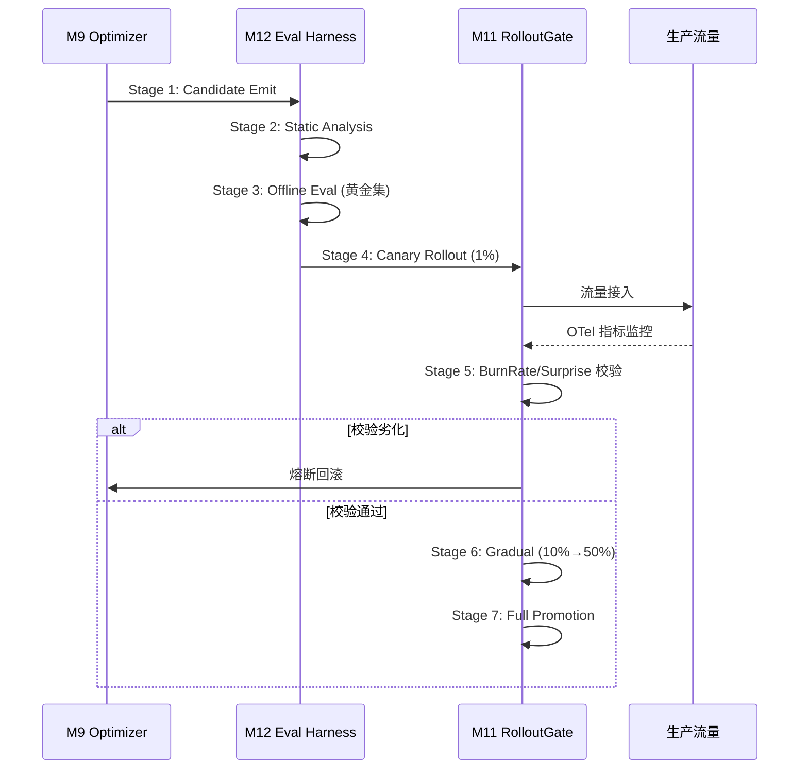

# 关键流程时序图

> 跨模块关键流程的 Mermaid 时序图集合。AI 默认不加载;读单图按 `Read offset/limit` 定位。
> **§跳读**: 1:9 Taint / 2:69 KillSwitch / 3:134 EventLog / 4:195 Intent→Result / 5:225 ToolCall / 6:252 Multi-Agent黑板 / 7:277 Staging7阶段

---

## 1. Taint Tracking 全链路 {#taint-tracking}

> 覆盖: 外部输入 → SanitizeBySchema → workspace 写入 → RAG 检索 → Agent 上下文注入
> 关键防卫点: M4 TaintGate Layer A.1 字符串字段 content constraint (format/pattern/enum/const)



---

## 2. KillSwitch 触发与响应链路 {#killswitch}

> 覆盖: M3 TokenBurnRate 检测 → M11 KillSwitch 阶段变迁 → M4/M8/M13 响应
> 关键防卫点: M4 仅读取 KillSwitch 阶段（不独立触发），M11 是 FSM 唯一权威持有者



---

## 3. EventLog 写入路径与崩溃恢复 {#eventlog}

> 覆盖: Agent Emit → EventWriteBuffer → DatabaseWriter → SQLite COMMIT → Outbox → 崩溃回放
> 关键防卫点: EventWriteBuffer 为纯缓冲层，所有写入经 DatabaseWriter 单写者串行化

```mermaid
sequenceDiagram
    participant Agent as M4 Agent
    participant EWB as M2 EventWriteBuffer
    participant MB as M2 MutationBus
    participant DW as M2 DatabaseWriter
    participant SQLite as SQLite WAL
    participant Outbox as M2 OutboxWorker
    participant M5 as M5 Episodic
    participant M9 as M9 MEMF/Heuristics

    Note over Agent,EWB: 热路径 (<1ms Emit)

    Agent->>EWB: Emit(StateTransitionEvent)
    Note over EWB: ch <- ev (<1μs)
    Agent->>EWB: Emit(StateTransitionEvent)
    Agent->>EWB: Emit(StateTransitionEvent)

    Note over EWB: 100ms ticker OR batch >= 64

    EWB->>EWB: leaseChecker.Verify (租约二次校验)
    Note over EWB: 失效事件 → 丢弃 + WARN

    EWB->>MB: Submit(MutationIntent{Priority=PriorityFlush, Table="events"})
    Note over MB: EventWriteBuffer 不持有独立写路径

    MB->>DW: ch <- intent
    Note over DW: 单写者串行化

    DW->>DW: flushBatch()
    DW->>SQLite: BEGIN IMMEDIATE
    DW->>SQLite: INSERT INTO events (批量)
    DW->>SQLite: INSERT INTO 业务表 (同事务)
    DW->>SQLite: COMMIT
    Note over DW: CompositeMutationIntent 跨 events+业务表原子提交

    SQLite-->>DW: COMMIT 成功

    loop Outbox 异步投影
        Outbox->>SQLite: SELECT * FROM outbox WHERE status='pending'
        Outbox->>M5: 投影到 episodic_events (+ embedding)
        Outbox->>M9: 投影到 HeuristicsMemory / MEMF
        Outbox->>SQLite: UPDATE outbox SET status='done'
    end

    Note over Agent,Outbox: === 崩溃恢复路径 ===

    Note over Agent: 进程崩溃, EventLog 完好

    Note over Agent: 重启: wake(sessionId)
    Agent->>SQLite: getEvents(sessionId) — 从 EventLog 回放
    Note over Agent: isReplaying = true (禁止 EmitEvent/ToolCall/Outbox)
    Agent->>Agent: 回放至 last success → 追平
    Note over Agent: isReplaying = false → 继续执行
---

## 4. Intent→Result 端到端时序图 {#intent-to-result}

> 覆盖: CLI 输入 → Intent 判定 → Agent 规划 → 执行验证 → 结果输出
> 关键路径包: `pkg/edge/scheduler`, `pkg/cognition/kernel`, `pkg/swarm/blackboard`

```mermaid
sequenceDiagram
    participant CLI as M13 Interface
    participant M4 as M4 Agent Kernel
    participant M1 as M1 Inference
    participant M7 as M7 Action Sandbox
    
    CLI->>M4: 提交用户 Intent
    Note over M4: FSM 状态: S_IDLE → S_PERCEIVE
    M4->>M1: LLM 结构化解析意图
    M1-->>M4: M4_PerceiveOutput
    Note over M4: FSM 状态: S_PERCEIVE → S_PLAN
    M4->>M1: 规划 DAG 子任务
    M1-->>M4: M4_PlanOutput (DAG)
    Note over M4: FSM 状态: S_PLAN → S_VALIDATE
    M4->>M4: 确定性校验图结构
    Note over M4: FSM 状态: S_VALIDATE → S_EXECUTE
    loop DAG 节点并发
        M4->>M7: ExecuteTool(taintLevel)
        M7-->>M4: ToolResult
    end
    Note over M4: FSM 状态: S_EXECUTE → S_REFLECT
    M4->>CLI: 返回 Result
```

## 5. Tool Call 完整执行链 {#tool-call-chain}

> 覆盖: 工具意图提取 → Sandbox 权限拦截 → 执行 → 审计记录
> 关键路径包: `pkg/action/tool`, `pkg/substrate/policy`



## 6. Multi-Agent 黑板协调 {#multi-agent-blackboard}

> 覆盖: CAS 原子认领, 任务分配, Supervisor Tree
> 关键路径包: `pkg/swarm/orchestrator`



## 7. Staging 7 阶段流转 {#staging-7-stages}

> 覆盖: 自进化代码/技能从生成到全面上线的门控体系
> 关键路径包: `pkg/swarm/eval_runner`, `pkg/substrate/policy`



---

**END OF DIAGRAMS.md**
